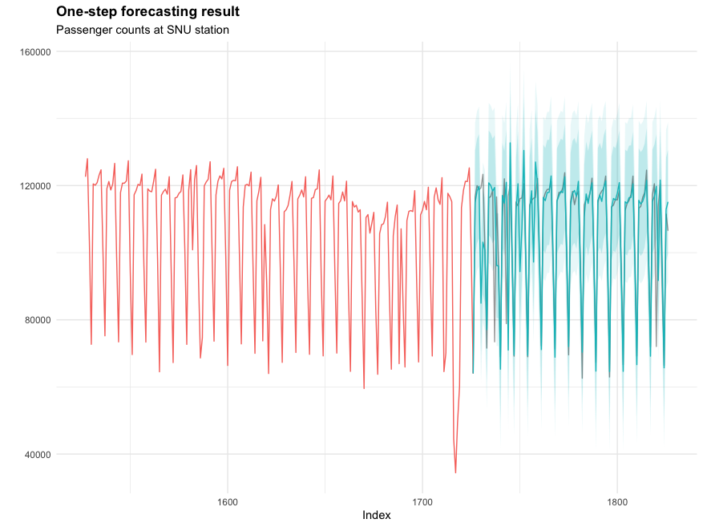
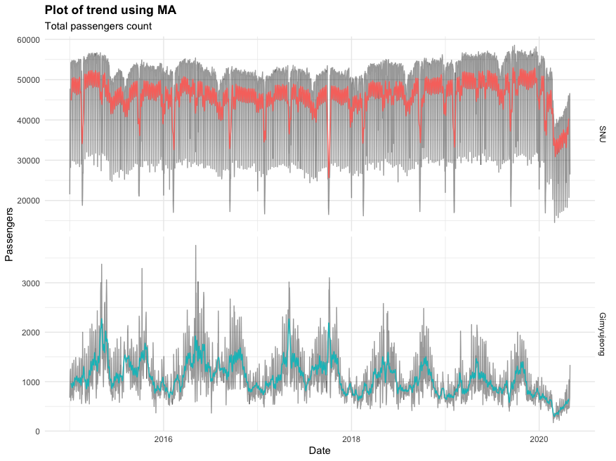
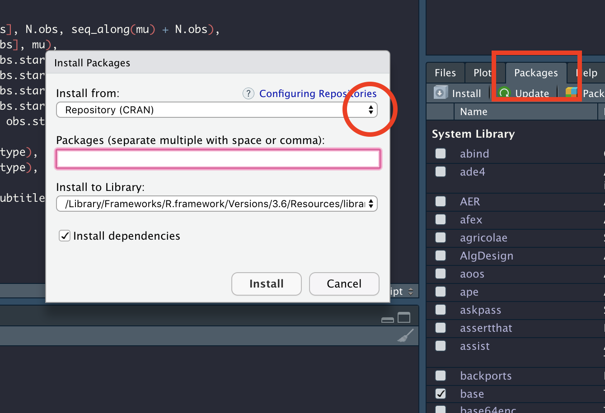
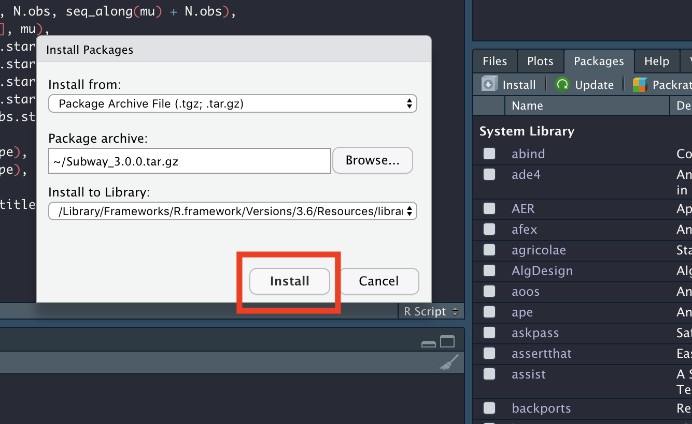

# Subway
R library for floating population prediction using SARIMA with easy visualization.

Authors: Sanghyun Park, Daun Jeong, and Sehun Kim

## Features

* Powerful model selection procedure with SARIMA(Seasonal AutoRegressive Integrated Moving Average: 계절 자기회귀누적이동평균). Optimized by parallel computing and CPU load balancing heuristics.

* One-cue simple test and foercasting procedures.

* Awesome time series visualization functions.





## Install
1. Fork this repo and clone it to your local machine.

```{console}
git clone https://github.com/eik4862/Subway.git
```

2. Open R studio (requires R version >= 2.10) and click install at packages panel. Click dropdown menu to select **Package Archive File (.tgz; .tar.gz)**.



3. From the pop-up file select window, select `Subway_3.0.0.tar.gz` and click install.



4. Enjoy!

## Environment
Currently, it fully supports *nix(Linux, Mac OS). Windows OS environment is now on testing.

## Maintainer
Bug report through mail(`lkd1962@naver.com`) or github issues.

## License
Creative Commons BY 2.0 KR
